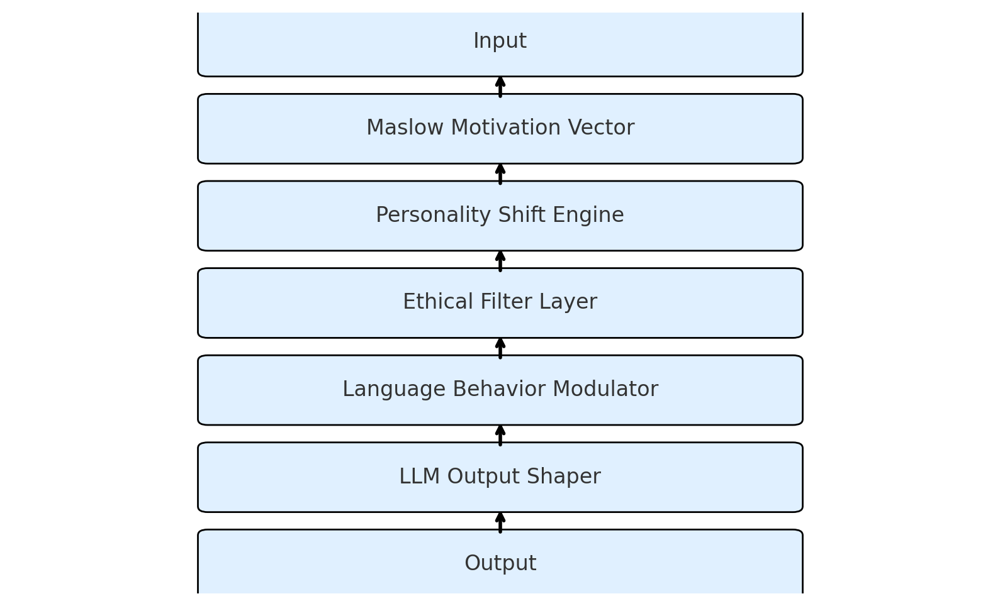

<p align="center">
  
</p>

# 🧠 EmpathAI Core

EmpathAI Core is an open-source framework for simulating **motivational**, **ethical**, and **narrative-based personality drift** in language-based AI.

EmpathAI Core 是一套開源框架，用於模擬語言型 AI 的**動機驅動、價值偏移**與**敘事人格演化邏輯**。

---

## 🌐 Architecture Overview｜架構總覽

<p align="center">
  
</p>

🧩 詳見架構邏輯文件：[`docs/architecture.md`](docs/architecture.md)  
📜 專案哲學理念：[`docs/principles.md`](docs/principles.md)  
🤝 貢獻者規範：[`CONTRIBUTING.md`](CONTRIBUTING.md)

---

## 🎮 Personality Drift Demo｜語言人格偏移互動展示

你可以體驗 EmpathAI Core 如何針對相同輸入，產生具人格風格差異的回應。

### ▶️ Run locally
```bash
cd demo
streamlit run app.py

💡 Why this matters / 為什麼它重要

Traditional LLMs often lack contextual emotional logic.
EmpathAI simulates the evolution of personality and value bias within natural language,
allowing AI to adapt more like a psychologically dynamic being.

傳統的大型語言模型常缺乏情境感受與價值偏移能力，EmpathAI 透過模擬「人格語言模型」，讓 AI 能展現更接近人類心理的語言互動。


---

📦 Project Structure｜專案目錄結構

EmpathAI-Core/
├── assets/               ← 圖片資源（封面、架構圖）
├── docs/                 ← 架構說明與核心理念
│   ├── architecture.md
│   └── principles.md
├── demo/                 ← Streamlit 互動測試
│   └── app.py
├── examples/             ← Prompt 與語言回應範例
├── CONTRIBUTING.md       ← 協作與貢獻說明
├── LICENSE               ← 開源授權（MIT）
└── README.md             ← 專案首頁說明


---

📬 Contact｜聯絡方式

如果你有想法、測試建議或希望合作：
📧 uvx8299@gmail.com


---

🆓 License

This project is released under the MIT License.
自由使用、再製與擴充，請保留創作歸屬即可。


---
